# IRFC Stock Market Analytics Dashboard


# 📈 IRFC Stock Market Analytics Dashboard

An interactive stock-market analytics project for exploring historical **Indian Railway Finance Corporation (IRFC)** market data through an interactive Streamlit dashboard.

The project transforms historical **OHLCV (Open, High, Low, Close, Volume)** data into an analytical dashboard covering price movements, moving averages, trading volume, daily returns, volatility, drawdown, and data-quality validation.

The dashboard is designed to make historical market data easier to explore through interactive charts, date filtering, KPI summaries, downloadable records, and transparent analytical calculations.

> **Project scope:** This is an educational historical-data analytics project. It describes past market data and does not provide investment advice, price targets, or buy/sell recommendations.

---

## 📌 Project Highlights

- Historical IRFC price and trading-volume analysis
- Interactive date-range filtering
- Latest closing-price and period-level KPI summaries
- Closing-price trend analysis
- OHLC candlestick visualization
- 20-day, 50-day, and 200-day moving averages
- Daily and monthly trading-volume analysis
- Daily-return distribution
- Return-volatility analysis
- Drawdown analysis from the running peak
- Interactive Plotly charts with hover information
- Filtered-data table with CSV download
- Automated data-quality checks
- Support for uploading another compatible CSV file
- Clean Streamlit dashboard suitable for portfolio demonstration

---

## 📊 Dataset

The dashboard uses the historical IRFC dataset:

`data/IRFC_BSE_Data.csv`

### Dataset fields

| Column | Description |
|---|---|
| `date` | Trading date |
| `open` | Opening price |
| `high` | Highest price recorded during the trading session |
| `low` | Lowest price recorded during the trading session |
| `close` | Closing price |
| `volume` | Number of shares traded |

### Dataset coverage shown in the dashboard

- **First available date:** 29 Jan 2021
- **Latest available date:** 06 Jan 2025
- **Valid trading-day records:** 970
- **Market fields:** OHLCV

The application validates and prepares the data before displaying the analysis.

> **Data note:** The dashboard uses a historical data snapshot. It is not a live market-data application.

---

## 🧹 Data Processing & Validation

Before analysis, the application performs several data-quality steps:

1. Standardizes column names.
2. Parses the date column into a consistent datetime format.
3. Converts OHLC and volume fields to numeric values.
4. Removes rows with missing required fields.
5. Removes duplicate trading dates.
6. Sorts records chronologically.
7. Validates OHLC relationships.
8. Excludes structurally invalid price records.
9. Excludes negative trading-volume records.
10. Creates derived analytical fields for returns, price changes, moving averages, and daily trading range.

The dashboard also exposes data-quality results so users can see the number of valid records, missing values, duplicate dates, and invalid OHLC rows.

---

## 🔍 Key Analytical Components

### 1. Price Trend Analysis

The dashboard visualizes historical closing prices to show how IRFC's market price changed throughout the available period.

The analysis includes:

- Daily closing-price trend
- Monthly closing-price summary
- Selected-period performance
- Period high and low

---

### 2. OHLC Candlestick Analysis

The candlestick chart visualizes:

- Open
- High
- Low
- Close

Users can zoom into specific periods and hover over individual trading sessions to inspect the underlying OHLC values.

---

### 3. Moving Average Analysis

The dashboard calculates and displays:

- **20-day moving average**
- **50-day moving average**
- **200-day moving average**

These rolling averages provide different time-horizon summaries of historical closing prices.

> Moving averages are descriptive historical indicators. They are not forecasts or automatic buy/sell signals.

---

### 4. Trading Volume Analysis

Trading activity is analyzed at two levels:

- Daily trading volume
- Monthly aggregated trading volume

This allows users to examine periods with relatively higher or lower trading activity.

---

### 5. Returns Analysis

Daily percentage returns are calculated from consecutive closing prices:

```text
Daily Return (%) =
((Current Close - Previous Close) / Previous Close) × 100
```

The dashboard presents the distribution of daily returns through an interactive histogram.

---

### 6. Volatility Analysis

Daily-return volatility is summarized using the standard deviation of daily percentage returns over the selected period.

This provides a descriptive measure of historical day-to-day return variation.

---

### 7. Drawdown Analysis

Drawdown measures the decline from the highest closing price reached up to each point in the selected period.

```text
Running Peak = Cumulative Maximum Closing Price

Drawdown (%) =
((Closing Price / Running Peak) - 1) × 100
```

The dashboard displays the drawdown profile and the maximum drawdown within the selected range.

---

## 🎛️ Dashboard Controls

The sidebar provides:

- Optional CSV upload
- Interactive date-range selection
- Dataset coverage information
- Valid trading-record count

The uploaded CSV can use either the normalized field names:

```text
date, open, high, low, close, volume
```

or compatible Alpha Vantage-style OHLCV column names.

---

# 📸 Dashboard Preview

The following screenshots document the major sections and analytical views of the application.

## 1. 🏠 Dashboard Overview

The main dashboard provides the overall analytical entry point with KPI cards, the selected date range, historical closing-price movement, and monthly closing-price visualization.

<p align="center">
  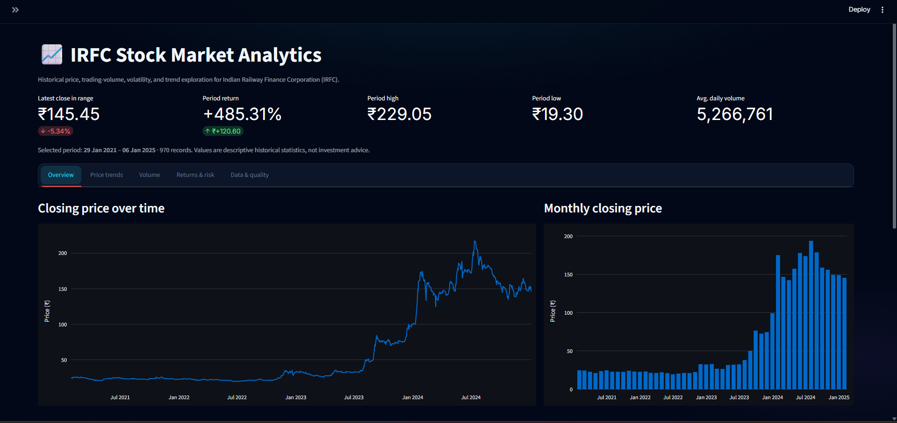
</p>

---

## 2. 🧭 Dashboard Overview with Sidebar Controls

The dashboard sidebar provides the optional CSV upload control, date-range selector, and dataset coverage information.

<p align="center">
  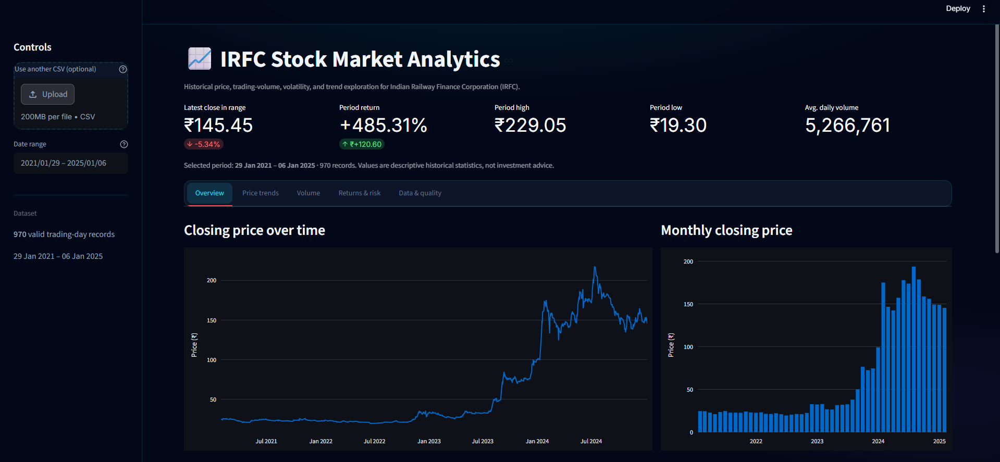
</p>

---

## 3. 📈 Closing Price Trend — Detailed View

The closing-price chart provides an interactive historical view where users can inspect individual dates and price movements.

<p align="center">
  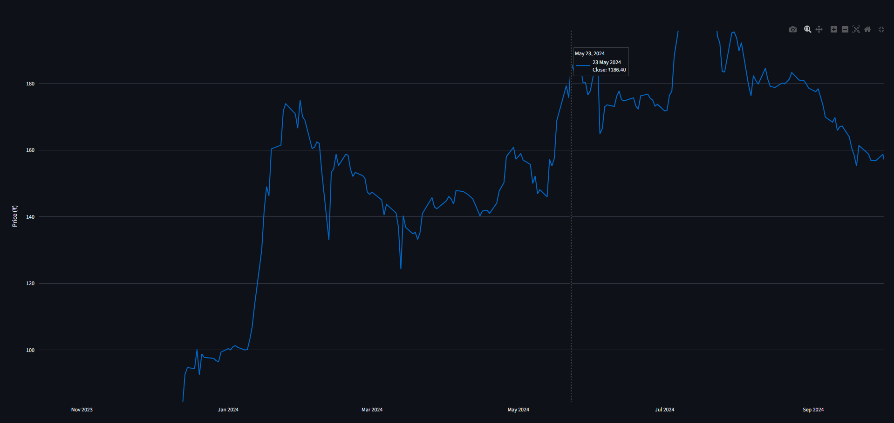
</p>

---

## 4. 📊 Monthly Closing Price

Monthly closing prices provide a higher-level view of how the month-end closing price changed across the historical period.

<p align="center">
  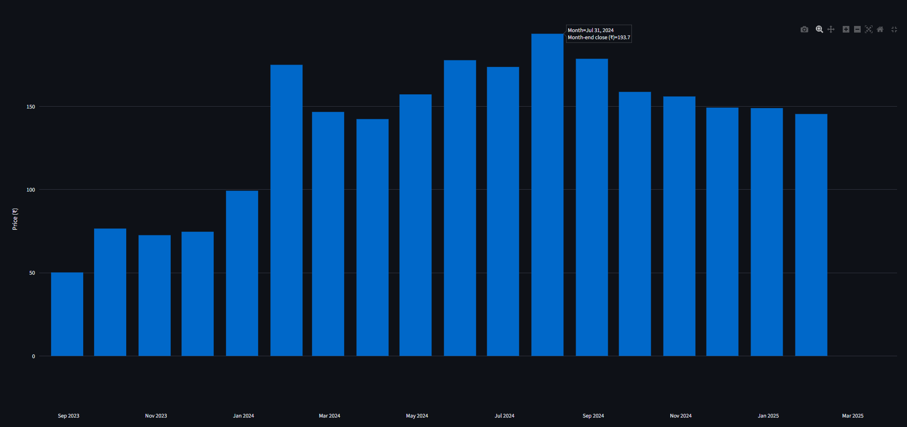
</p>

---

## 5. 🕯️ OHLC Price Range

The full-period candlestick chart visualizes IRFC's historical Open, High, Low, and Close values.

<p align="center">
  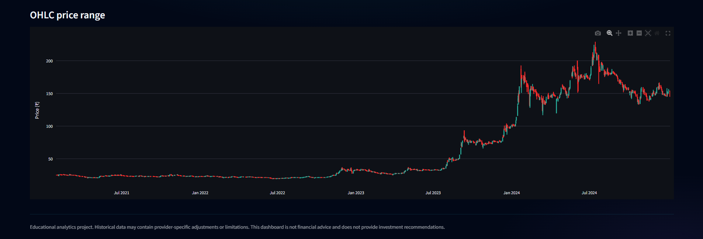
</p>

---

## 6. 🔎 OHLC Candlestick — Detailed View

The detailed candlestick view allows users to zoom into a shorter period and inspect individual trading sessions through interactive hover information.

<p align="center">
  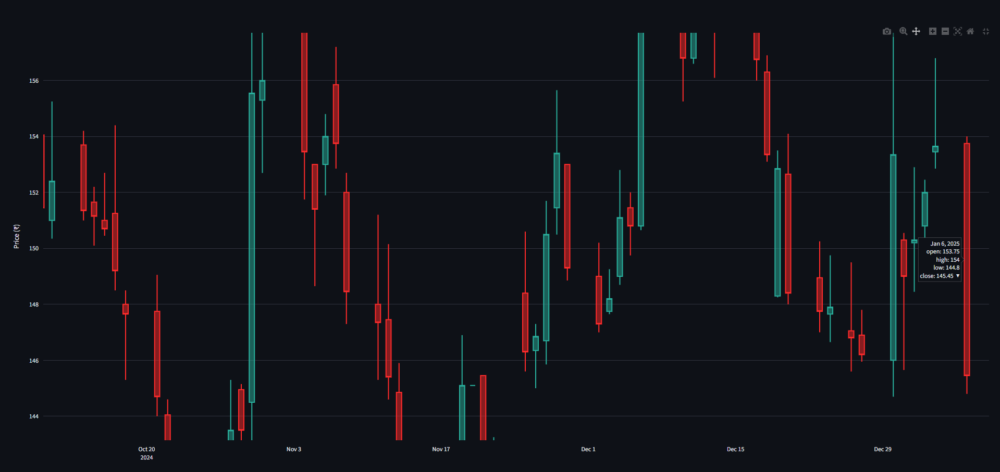
</p>

---

## 7. 📉 Closing Price with Moving Averages

This view compares the closing price with the 20-day, 50-day, and 200-day moving averages.

<p align="center">
  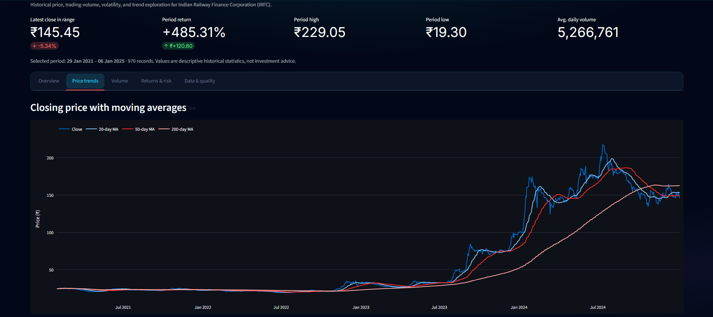
</p>

---

## 8. 📊 Moving Average Analysis — Detailed View

The detailed view provides a closer look at the relationship between the closing price and the three rolling moving-average windows.

<p align="center">
  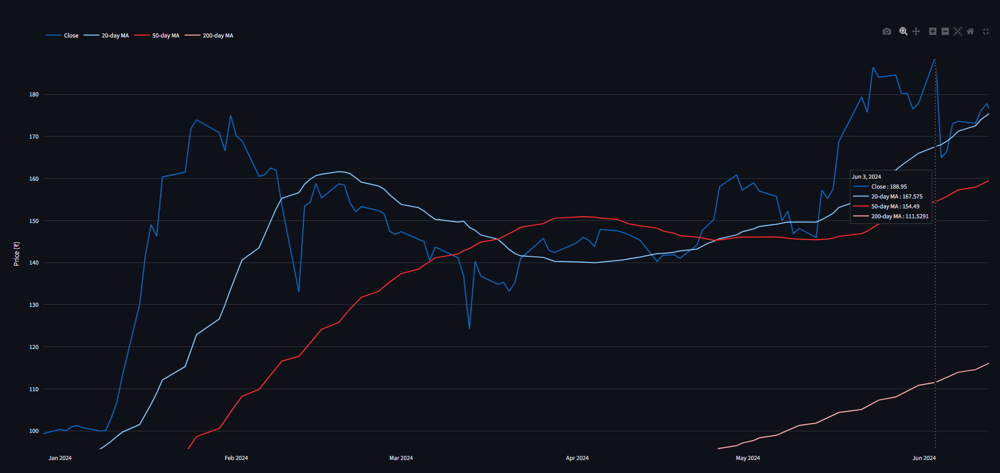
</p>

---

## 9. 📈 Daily Trading Volume

Daily trading volume shows the number of shares traded on each available trading day and highlights periods of increased market activity.

<p align="center">
  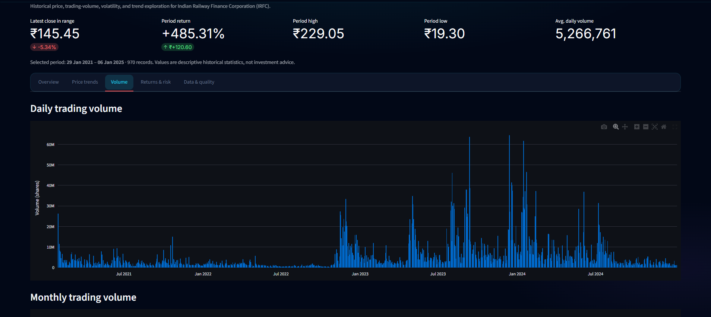
</p>

---

## 10. 🔎 Daily Volume — Detailed View

The interactive detailed view allows users to inspect individual volume observations and identify high-volume trading sessions.

<p align="center">
  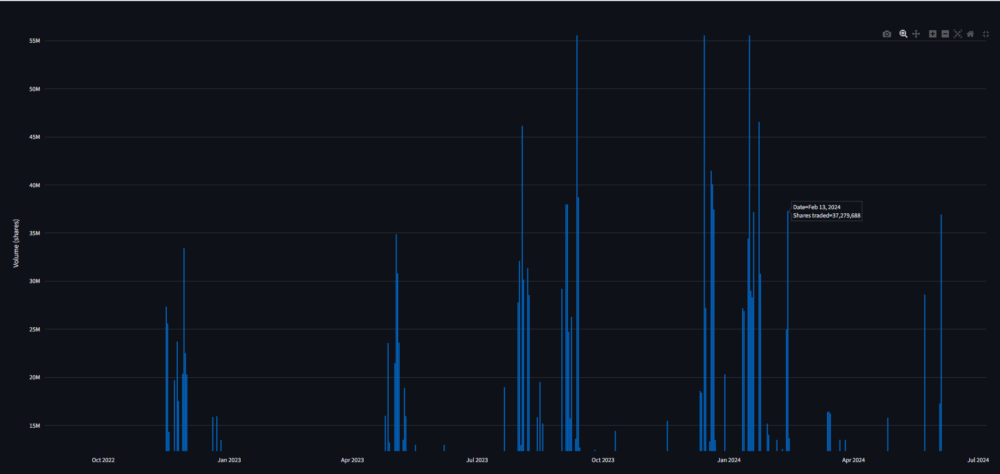
</p>

---

## 11. 📊 Monthly Trading Volume

Monthly aggregation provides a broader view of trading activity across the historical period.

<p align="center">
  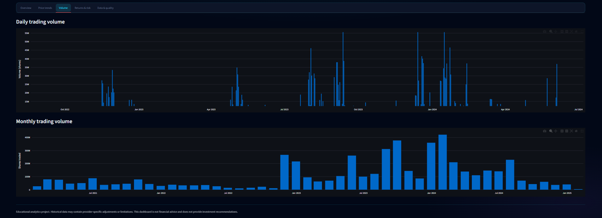
</p>

---

## 12. 📉 Returns & Drawdown Analysis

The Returns & Risk section contains the daily-return distribution, historical return volatility, and drawdown profile.

<p align="center">
  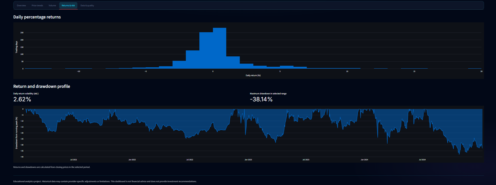
</p>

---

## 13. 🧪 Data Quality & Validation

The Data & Quality section provides the filtered historical records together with validation results for missing values, duplicate dates, and invalid OHLC records.

<p align="center">
  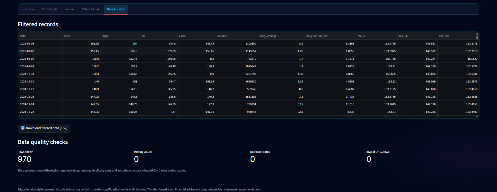
</p>

---

## 🧮 Derived Metrics

The application calculates the following analytical measures.

### Daily Change

```text
Daily Change = Current Close - Previous Close
```

### Daily Return

```text
Daily Return (%) =
((Current Close / Previous Close) - 1) × 100
```

### Moving Average

For a rolling window of `N` trading days:

```text
Moving Average =
Mean of the previous N closing prices
```

The dashboard uses:

- 20-day MA
- 50-day MA
- 200-day MA

### Daily Trading Range

```text
Daily Range (%) =
((High - Low) / Open) × 100
```

### Drawdown

```text
Drawdown (%) =
((Close / Running Peak) - 1) × 100
```

---

## 🗂️ Project Structure

```text
irfc-stock-market-analytics/
│
├── app.py
├── requirements.txt
├── README.md
├── .gitignore
│
├── data/
│   └── IRFC_BSE_Data.csv
│
├── notebooks/
│   └── 01_alpha_vantage_data_collection.ipynb
│
└── assets/
    ├── 01.png
    ├── 02.png
    ├── 03.png
    ├── 04.png
    ├── 05.png
    ├── 06.png
    ├── 07.png
    ├── 08.png
    ├── 09.png
    ├── 10.png
    ├── 11.png
    ├── 12.png
    └── 13.png
```

---

## 🛠️ Tech Stack

| Technology | Purpose |
|---|---|
| **Python** | Application and analytical logic |
| **Pandas** | Data loading, cleaning, transformation, and aggregation |
| **NumPy** | Numerical calculations |
| **Plotly** | Interactive charts and financial visualizations |
| **Streamlit** | Interactive web dashboard |
| **Jupyter Notebook** | Data-collection and exploratory workflow |
| **CSV** | Historical market-data storage |

---

## 📓 Data Collection Notebook

The repository includes a Jupyter notebook documenting the historical market-data collection workflow using **Alpha Vantage**.

```text
notebooks/
└── 01_alpha_vantage_data_collection.ipynb
```

The notebook is kept separate from the Streamlit application so that data collection and dashboard presentation remain clearly organized.

> **API security:** API keys must never be hard-coded into source files or committed to GitHub. Use environment variables or the deployment platform's secrets manager when collecting fresh data.

---

## 🚀 Installation

Clone the repository:

```bash
git clone https://github.com/YOUR-USERNAME/YOUR-REPOSITORY.git
cd irfc-stock-market-analytics
```

Create a virtual environment:

### Windows — Command Prompt

```bash
python -m venv .venv
.venv\Scripts\activate
```

### Windows — Git Bash

```bash
source .venv/Scripts/activate
```

### macOS / Linux

```bash
python3 -m venv .venv
source .venv/bin/activate
```

Install dependencies:

```bash
python -m pip install --upgrade pip
pip install -r requirements.txt
```

---

## ▶️ Run the Dashboard

Start Streamlit:

```bash
streamlit run app.py
```

The application will normally be available at:

```text
http://localhost:8501
```

The bundled dataset should remain at:

```text
data/IRFC_BSE_Data.csv
```

The dashboard also provides an optional CSV upload feature for compatible datasets.

---

## 📥 Download Filtered Data

After selecting a date range, users can review the filtered records in the **Data & Quality** section and download the resulting dataset as a CSV file.

This makes the dashboard useful not only for visualization but also for exporting a filtered analytical dataset for further work.

---

## 🔐 Data & Security Notes

- The dashboard uses a historical dataset rather than a live market feed.
- API credentials are not required to run the dashboard with the bundled CSV.
- Never commit Alpha Vantage API keys or other secrets to GitHub.
- If an API key has previously been exposed, revoke or rotate it.
- Historical market data can have provider-specific adjustments or limitations.

---

## ⚠️ Important Limitations

- The dataset represents historical market observations and is not a future-price forecasting model.
- Historical returns do not guarantee future performance.
- Moving averages summarize past price behavior and should not be interpreted as automatic trading signals.
- Volatility and drawdown statistics depend on the selected date range.
- The dashboard does not account for brokerage charges, taxes, dividends, corporate actions, or an individual's investment situation.
- The application does not provide investment recommendations or price targets.
- Results are dependent on the quality, coverage, and methodology of the underlying data provider.

---

## 🔮 Future Improvements

- Add additional technical indicators such as RSI, MACD, and Bollinger Bands.
- Add comparative analysis against relevant market benchmarks.
- Add calendar-based and year-over-year performance analysis.
- Add richer data-quality reporting.
- Add automated data-refresh workflows using secure API credentials.
- Add automated unit tests for data processing and analytical calculations.
- Deploy the dashboard using Streamlit Community Cloud.
- Add optional model-based time-series forecasting as a separate experimental module with proper backtesting.

---

## 🎯 Learning Outcomes

This project provided practical experience in:

- Financial-data preprocessing
- Time-series data analysis
- Data validation
- Exploratory data analysis
- OHLC and candlestick visualization
- Moving-average calculations
- Trading-volume analysis
- Return and volatility analysis
- Drawdown analysis
- Interactive Plotly visualization
- Streamlit dashboard development
- CSV data export
- GitHub project organization
- API-data collection workflow

---

## 👨‍💻 Author

**Nadeem Ahamad**

Data Analytics Project associated with **Hackveda Solutions Private Limited Internship**.

**Focus:** Historical Stock Market Analysis · Data Analytics · Time-Series Analysis · Interactive Visualization · Streamlit Dashboard

---

## ⭐ Project Note

If you find this project useful for learning data analytics, financial-data visualization, or Streamlit dashboard development, consider giving the repository a ⭐ on GitHub.

---

### Disclaimer

This project is created for **educational and portfolio purposes**. The dashboard presents historical market-data analysis only and does not constitute financial, investment, trading, or tax advice.
